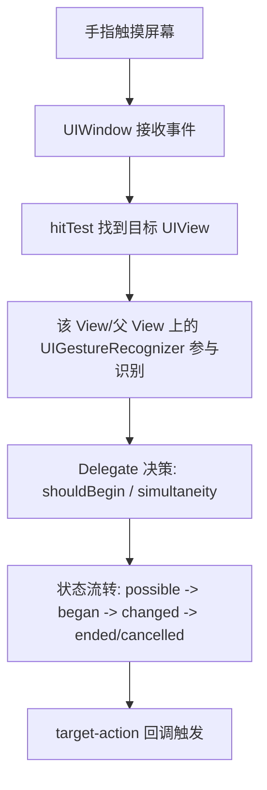
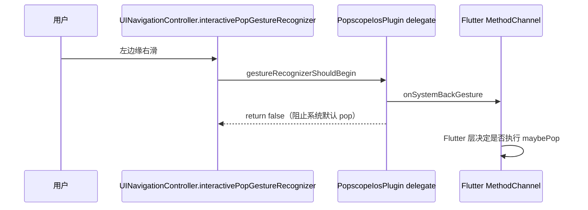
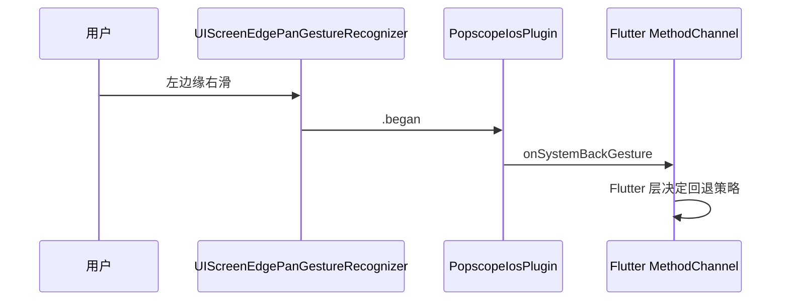
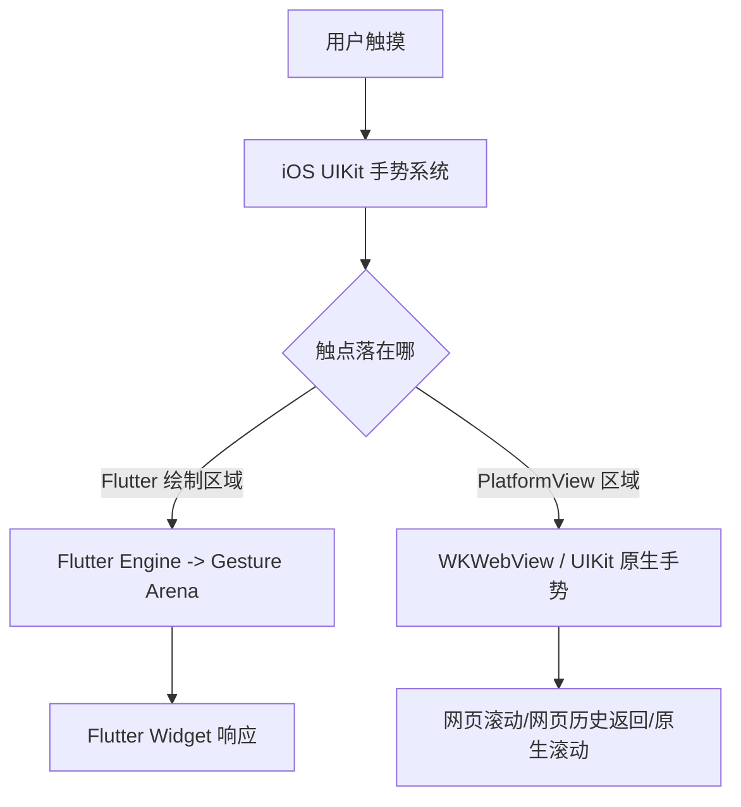
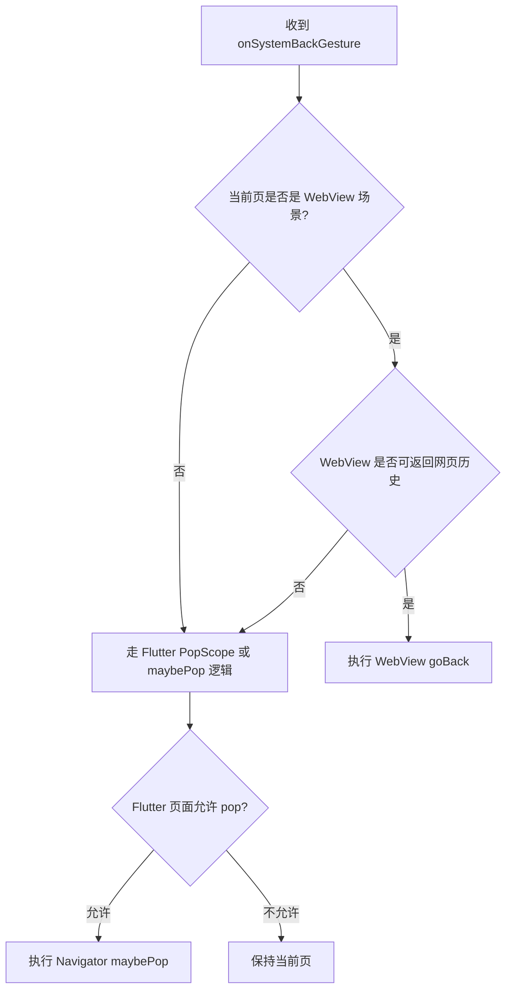

# iOS 手势学习笔记（结合 popscope_ios_plus 与 Flutter WebView）

> 目标：帮你用“插件实战视角”理解 iOS 手势，并且清楚区分 **纯 iOS 手势拦截** 和 **Flutter + WebView 混合手势分发**。

## 0. 先给结论（你现在最该抓住的点）

1. 你的插件核心是“**把系统返回手势信号抛给 Flutter 决策**”，而不是在 iOS 里直接做页面返回。
2. iOS 原生手势问题，重点在 `UIGestureRecognizerDelegate` 的冲突控制。
3. Flutter + WebView 场景是“多手势系统叠加”：系统手势 + Flutter 手势竞技场 + WKWebView 内部手势。
4. WebView 场景里，通常应先判断 `WebViewController.canGoBack()`，再决定是否交给 Flutter 路由 `Navigator.maybePop()`。

### 术语约定（统一口径）

- “系统返回手势事件”统一指 `onSystemBackGesture`。
- “Flutter 路由返回”统一用 `Navigator.maybePop()` 表述。
- “WebView 返回”统一指网页历史返回（`canGoBack() -> goBack()`）。

---

## 1. A 部分：iOS 原生手势（UIKit）

这一部分只看 UIKit，不看 Flutter。

### 1.1 触摸到手势识别的基本流程

### 1.2 与你插件最相关的 4 个知识点

- `gestureRecognizerShouldBegin`：是否允许一个手势开始（你现在拦截返回手势的主入口）。
- `shouldRecognizeSimultaneouslyWith`：是否允许两个手势同时识别（处理滚动冲突很关键）。
- `cancelsTouchesInView`：手势识别后是否取消子视图触摸（影响列表/按钮交互）。
- `UIScreenEdgePanGestureRecognizer` vs `UIPanGestureRecognizer`：前者只在边缘触发，更接近“系统返回”语义。

### 1.3 你当前插件里的两种模式（UIKit 视角）

#### 模式 1：拦截 `interactivePopGestureRecognizer`

对应 `ios/popscope_ios/Sources/popscope_ios/PopscopeIosPlugin.swift:146` 和 `ios/popscope_ios/Sources/popscope_ios/PopscopeIosPlugin.swift:315`。

特点：
- 优点：语义直接，和系统返回手势绑定。
- 难点：依赖 `UINavigationController`，没有导航容器时处理复杂。

#### 模式 2：直接加 `UIScreenEdgePanGestureRecognizer`

对应 `ios/popscope_ios/Sources/popscope_ios/PopscopeIosPlugin.swift:171` 和 `ios/popscope_ios/Sources/popscope_ios/PopscopeIosPlugin.swift:250`。

特点：
- 优点：不强依赖 `UINavigationController`。
- 难点：需要自己处理与滚动/横滑组件的冲突策略。

---

## 2. B 部分：Flutter + iOS + WebView 手势（跨层）

这一部分是“混合系统”，必须和上面的 UIKit 基础区分开。

### 2.1 三层手势系统同时存在

### 2.2 与 WebView 组合时，最容易混淆的 3 种“返回”

1. **系统页面返回**：iOS 导航栈返回（常表现为 pop，你插件主要控制这一层手势信号）。
2. **WebView 页面历史返回**：`WKWebView.goBack()`（网页内部历史）。
3. **Flutter 路由返回**：`Navigator.maybePop()`（Flutter 路由栈）。

> 关键点：这三者不等价，必须有优先级策略。

### 2.3 推荐的统一决策顺序（WebView 场景）

### 2.4 插件层落地策略（避免影响 WebView）

- `onSystemBackGesture` 到 Flutter 后，先执行页面/业务回调（例如 WebView 页面回调）。
- 只有在“没有可用回调”时，才执行自动 `Navigator.maybePop()`。
- 这样 WebView 页面可以优先 `canGoBack -> goBack`，避免被插件直接 pop 路由。

---

## 3. A 与 B 的边界（必须区分）

| 维度 | A: iOS 原生手势（UIKit） | B: Flutter + WebView 手势（跨层） |
|---|---|---|
| 关注点 | 手势识别是否开始、是否冲突 | 信号到达后由哪一层消费 |
| 主要 API | `UIGestureRecognizerDelegate` | `MethodChannel` + Flutter 路由 + WebView 控制器 |
| 返回语义 | 系统导航行为 | 系统返回 / 网页返回 / Flutter 返回三选一 |
| 常见问题 | 手势冲突、误触发 | 决策优先级不清导致“返回错层” |
| 你插件职责 | 把 iOS 手势稳定上报 | 提供足够信息让 Flutter 正确决策 |

---

## 4. 你可以立刻实操的学习路线（按优先级）

### 第 1 步（今天）
- 只看 `gestureRecognizerShouldBegin` 与 `shouldRecognizeSimultaneouslyWith`。
- 用 Example 做 3 个手测：
  - 空白页左边缘滑动
  - 水平 `ListView` 左边缘滑动
  - WebView 页左边缘滑动

### 第 2 步（明天）
- 给 Flutter 层加统一“返回决策器”（先 WebView，再 Flutter pop）。
- 日志里明确打印：`system_back` / `webview_back` / `flutter_pop`。

### 第 3 步（后续）
- 评估是否需要“手势进度”能力（`.changed`）来做更自然过渡。
- 补充冲突测试矩阵（横向滑动组件、嵌套滚动、全屏手势）。

---

## 5. 调试建议（非常实用）

- iOS 侧日志至少打印：手势类型、state、是否被拦截、当前 VC 类型。
- Flutter 侧日志至少打印：当前 route、是否 webview、`canGoBack` 结果、最终动作。
- 出现“误返回”时先判断是哪个层级消费了事件，再调策略，不要盲改阈值。

---

## 6. 给你当前插件的定位建议

- 插件层：尽量做“稳定手势信号源”，少做业务决策。
- Flutter 层：做“返回策略中心”（尤其是 WebView 组合场景）。
- 文档层：把 A/B 两类问题分开写，排查效率会明显提升。
