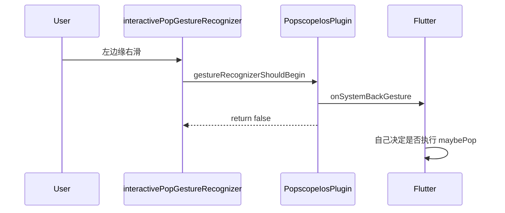
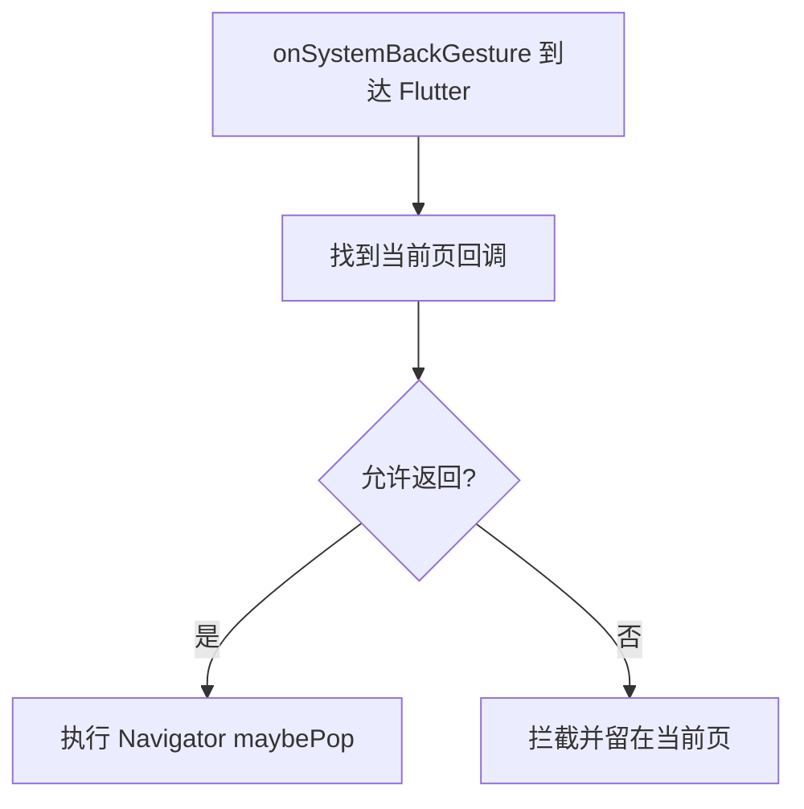
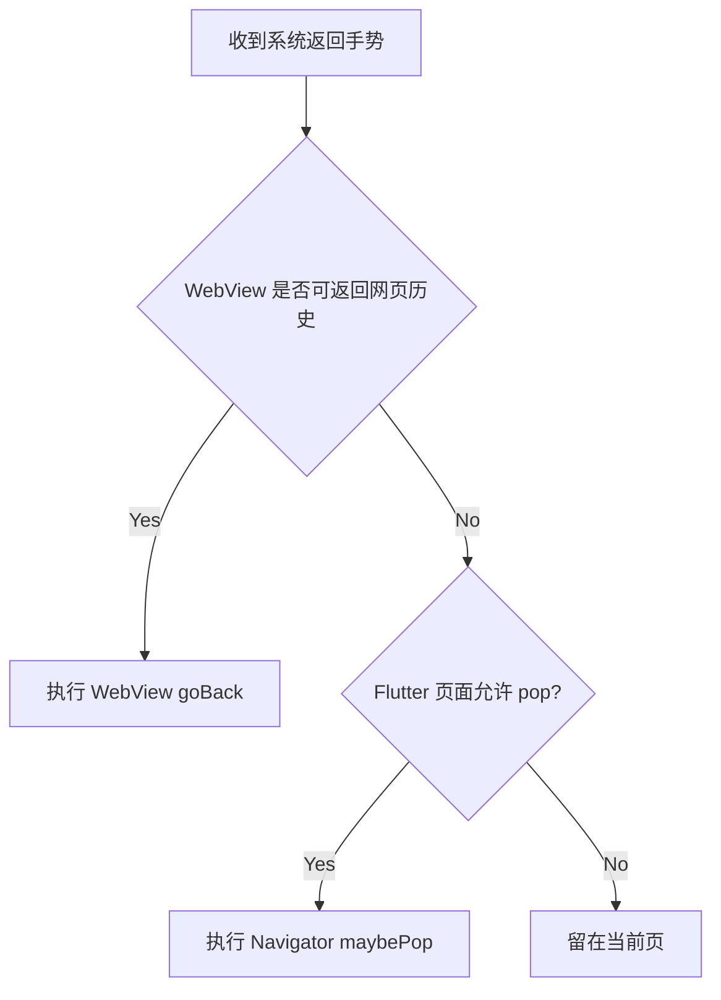

# iOS 手势学习（最小可运行代码骨架）

> 这份是“代码导向版”：把你要学的内容拆成两块：
> - A：纯 iOS 手势拦截（UIKit）
> - B：Flutter + WebView 手势分发（跨层）

术语约定：
- “系统返回手势事件”统一指 `onSystemBackGesture`。
- “Flutter 路由返回”统一用 `Navigator.maybePop()` 表述。
- “WebView 返回”统一指网页历史返回（`canGoBack() -> goBack()`）。

---

## 1. A：纯 iOS 手势拦截（UIKit）

### 1.1 最小流程图



### 1.2 Swift 最小骨架（可学习版）

```swift
import Flutter
import UIKit

public class PopscopeIosPlugin: NSObject, FlutterPlugin, UIGestureRecognizerDelegate {
  private weak var navigationController: UINavigationController?
  private var originalDelegate: UIGestureRecognizerDelegate?
  private var channel: FlutterMethodChannel?

  public static func register(with registrar: FlutterPluginRegistrar) {
    let channel = FlutterMethodChannel(name: "popscope_ios_plus", binaryMessenger: registrar.messenger())
    let instance = PopscopeIosPlugin()
    instance.channel = channel
    registrar.addMethodCallDelegate(instance, channel: channel)
  }

  public func handle(_ call: FlutterMethodCall, result: @escaping FlutterResult) {
    switch call.method {
    case "enableInteractivePopGesture":
      DispatchQueue.main.async {
        self.setupInteractivePopGestureIfNeeded()
      }
      result(nil)
    default:
      result(FlutterMethodNotImplemented)
    }
  }

  private func setupInteractivePopGestureIfNeeded() {
    guard
      let window = UIApplication.shared.connectedScenes
        .compactMap({ $0 as? UIWindowScene })
        .flatMap({ $0.windows })
        .first(where: { $0.isKeyWindow }),
      let nav = window.rootViewController as? UINavigationController
    else { return }

    navigationController = nav
    setupInteractivePopGesture()
  }

  private func setupInteractivePopGesture() {
    originalDelegate = navigationController?.interactivePopGestureRecognizer?.delegate
    navigationController?.interactivePopGestureRecognizer?.delegate = self
  }

  public func gestureRecognizerShouldBegin(_ gestureRecognizer: UIGestureRecognizer) -> Bool {
    if gestureRecognizer == navigationController?.interactivePopGestureRecognizer {
      channel?.invokeMethod("onSystemBackGesture", arguments: nil)
      return false
    }
    return originalDelegate?.gestureRecognizerShouldBegin?(gestureRecognizer) ?? true
  }
}
```

学习重点：
- `delegate = self` 把决策权拿到插件。
- 在 `gestureRecognizerShouldBegin` 里上报事件并 `return false`，阻止系统默认返回。
- 业务决策尽量留给 Flutter。

---

## 2. B：Flutter 页面（不含 WebView）最小骨架

### 2.1 流程图



### 2.2 Dart 最小骨架

```dart
import 'package:flutter/material.dart';
import 'package:popscope_ios_plus/popscope_ios.dart';

class GestureDemoPage extends StatefulWidget {
  const GestureDemoPage({super.key});

  @override
  State<GestureDemoPage> createState() => _GestureDemoPageState();
}

class _GestureDemoPageState extends State<GestureDemoPage> {
  bool _registered = false;

  @override
  void didChangeDependencies() {
    super.didChangeDependencies();
    if (!_registered) {
      PopscopeIos.registerPopGestureCallback(_onSystemBackGesture, context);
      _registered = true;
    }
  }

  Future<void> _onSystemBackGesture() async {
    final allowPop = await _canLeavePage();
    if (!mounted) return;
    if (allowPop) {
      Navigator.of(context).maybePop();
    }
  }

  Future<bool> _canLeavePage() async {
    // 在这里接业务逻辑：未保存表单、确认弹窗等
    return true;
  }

  @override
  void dispose() {
    if (_registered) {
      PopscopeIos.unregisterPopGestureCallback(context);
    }
    super.dispose();
  }

  @override
  Widget build(BuildContext context) {
    return const Scaffold(
      body: Center(child: Text('Gesture demo')),
    );
  }
}
```

---

## 3. B+：Flutter + WebView 场景（重点区分）

### 3.1 先看决策顺序图



### 3.2 依赖（加在业务 App，不是插件本体）

```yaml
dependencies:
  webview_flutter: ^4.7.0
```

### 3.3 Dart 最小骨架（WebView 优先）

```dart
import 'package:flutter/material.dart';
import 'package:popscope_ios_plus/popscope_ios.dart';
import 'package:webview_flutter/webview_flutter.dart';

class WebViewBackDemoPage extends StatefulWidget {
  const WebViewBackDemoPage({super.key});

  @override
  State<WebViewBackDemoPage> createState() => _WebViewBackDemoPageState();
}

class _WebViewBackDemoPageState extends State<WebViewBackDemoPage> {
  late final WebViewController _webController;
  bool _registered = false;

  @override
  void initState() {
    super.initState();
    _webController = WebViewController()
      ..setJavaScriptMode(JavaScriptMode.unrestricted)
      ..loadRequest(Uri.parse('https://flutter.dev'));
  }

  @override
  void didChangeDependencies() {
    super.didChangeDependencies();
    if (!_registered) {
      PopscopeIos.registerPopGestureCallback(_handleBackGesture, context);
      _registered = true;
    }
  }

  Future<void> _handleBackGesture() async {
    // 1) 先消费网页历史
    if (await _webController.canGoBack()) {
      await _webController.goBack();
      return;
    }

    // 2) 再决定 Flutter 路由
    if (!mounted) return;
    final allowFlutterPop = await _canPopFlutterPage();
    if (allowFlutterPop && mounted) {
      Navigator.of(context).maybePop();
    }
  }

  Future<bool> _canPopFlutterPage() async {
    return true;
  }

  @override
  void dispose() {
    if (_registered) {
      PopscopeIos.unregisterPopGestureCallback(context);
    }
    super.dispose();
  }

  @override
  Widget build(BuildContext context) {
    return Scaffold(
      appBar: AppBar(title: const Text('WebView Back Demo')),
      body: WebViewWidget(controller: _webController),
    );
  }
}
```

### 3.4 插件策略建议（WebView-safe）

- 回调优先：先让页面回调处理，再考虑自动 `maybePop`。
- 自动 pop 兜底：仅当没有任何可用回调时触发。
- 结果：WebView 场景不会被插件“抢先 pop”，可先处理网页历史返回。

---

## 4. A / B 快速对照（防混淆）

| 问题类型 | 你先看哪一层 | 典型处理 |
|---|---|---|
| 左边缘滑不触发 | iOS UIKit 层（A） | 看 delegate 是否挂上、手势是否 begin |
| WebView 内页返回错了 | Flutter 决策层（B） | `canGoBack` 是否优先 |
| 列表横滑冲突 | A + B | iOS 同时识别策略 + Flutter 页面策略 |
| 返回行为偶发不一致 | B | 把动作日志拆分为 webview_back / flutter_pop |

---

## 5. 你接下来可直接做的练习

1. 先跑“普通页骨架”，确认系统返回手势到 Flutter 的闭环。
2. 再跑“WebView 骨架”，确认返回优先级：`goBack > maybePop`。
3. 给日志打标签：`system_back`、`webview_back`、`flutter_pop`，便于排查错层问题。
